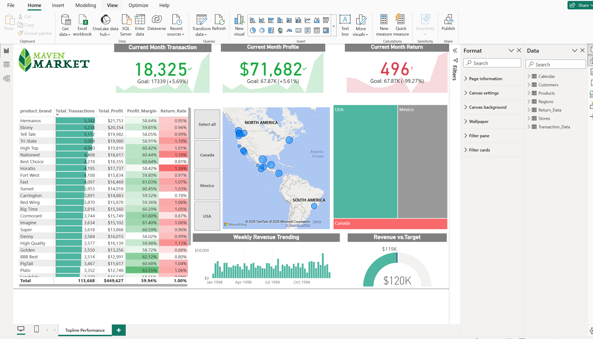
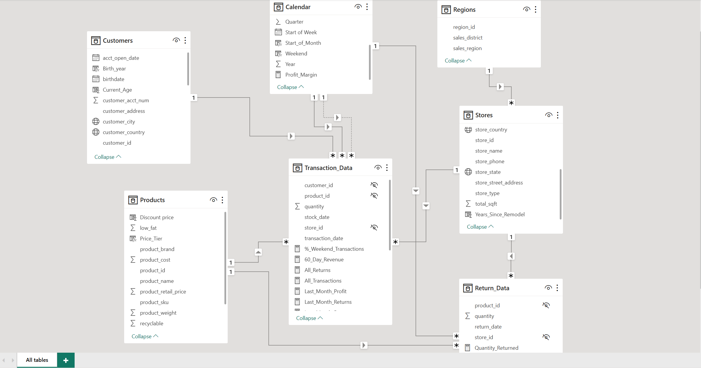

# Maven Market Performance Dashboard

## 📋 Project Overview
An executive-level Power BI dashboard showcasing sales performance, profitability, return rates, and weekly revenue trends across product brands and store locations.

The dashboard consolidates key metrics and enables interactive analysis by geography, brand, and time using dynamic filters and drill-down visuals.

## 📷 Dashboard Preview

## 🧩 Data Model
The dashboard is built on a star-schema–based data model designed for performance, clarity, and scalable analytics. It separates transactional facts from descriptive dimensions and uses a dedicated calendar table for time intelligence.

### 📊 Fact Tables
- **Transaction_Data**: sales transactions (quantity, transaction_date, customer_id, product_id, store_id)
- **Return_Data**: product returns (quantity, return_date, product_id, store_id)

### 🗂 Dimension Tables
- **Products**: product attributes and brand info
- **Customers**: customer demographics and location
- **Stores**: store location and store details
- **Regions**: sales region and district hierarchy
- **Calendar**: date, start of week, month, quarter, year

### 🔗 Relationships
- One-to-many relationships from dimensions to fact tables
- Single-direction filtering for predictable behavior
- Calendar is used for time-based analysis and trending

### 📷 Data Model Diagram

## 🎯 Key Features
- KPI cards with targets and variance
- Conditional formatting (green/red indicators)
- Brand-level performance analysis
- Geographic analysis (map + treemap)
- Time-based revenue trending

## 🛠 Tools Used
Power BI | DAX | SQL | Data Modeling
